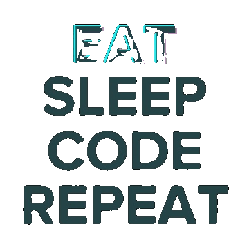
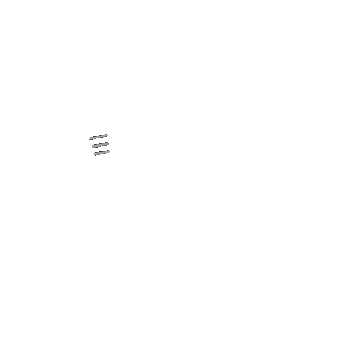

<image align="center" src="banner-m.png">
  
---

  
   
  

  

---

## Socials:
 
  
    
 

# Tech Stack:
#### Primary Development Languages : 

#### Languages for Code Adaptation :

 
 
 
 
 
 
 
 

#### Web Services :

 

---

   
  
   

<table>
  <tr>
    <td width="33%" align="center">
      <h3>Interactive Calculator First Edition</h3>
      
Responsive number system converter handling Binary, Decimal, Octal, and Hex.

      
    </td>
    <td width="33%" align="center">
      <h3>ADPKG Library</h3>
      
Python toolkit for complex math: compound interest, matrices, and stats.

      
    </td>
    <td width="33%" align="center">
      <h3>Compiler*</h3>
      
Online compiler powered by Render Backend. Supports C, C++, and Python.

      
    </td>
  </tr>
  <tr>
    <td width="33%" align="center">
      <h3>WBSU Repository*</h3>
      
Complete collection of B.Sc. Hons Computer Science practical codes.

       
      
    </td>
    <td width="33%" align="center">
      <h3>Project ADA*</h3>
      
Custom trained deep learning model optimized for high accuracy performance.

      
    </td>
    <td width="33%" align="center">
      <h3>ESAL-1.0 License</h3>
      
Educational Source-Available License with strict Anti-Plagiarism Clause.

      
    </td>
  </tr>
  <tr>
    <td width="33%" align="center">
      <h3>Mojic*</h3>
      
A versatile NPM package for seamless text and emoji processing integration in JavaScript projects.

      
    </td>
    <td width="33%" align="center">
      <h3>Githrun</h3>
      
Python CLI to run, install, and explore GitHub scripts instantly without cloning.

      
    </td>
    <td width="33%" align="center">
      <h3>Interactive Calculator legacy Edition</h3>
      
Responsive number system converter handling Binary, Decimal, Octal, and Hex.

      
    </td>
  </tr>
</table>
<table>
  <tr>
    <td width="100%" align="center">
      <h3>WhatsApp Logger (Self-Hosted)*</h3>
      
A privacy-first, self-hosted archive for WhatsApp conversations.

      
WhatsApp Logger is a "Companion Device" that runs in the cloud. It connects to your WhatsApp account just like WhatsApp Web, but instead of just displaying messages, it <strong>saves them permanently</strong> to your private database.

      
    </td>
  </tr>
</table>

> ### * Project is still in progress.

## My GitHub Stats

  
  

